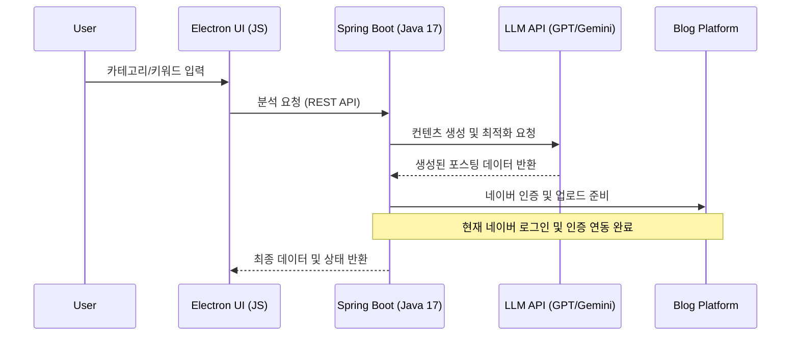

# 🤖 AI-Log: Content Automation System
> **엔터프라이즈 시스템 설계 역량을 기반으로 한 AI 블로그 자동화 솔루션**

---

## 📌 Project Strategy
본 프로젝트는 **PLM/ALM 환경에서 축적한 시스템 통합(SI) 및 워크플로우 설계 경험**을 퍼스널 도구로 확장한 사례입니다. 
단순한 스크립트를 넘어, 확장 가능한 **Backend-to-Desktop 아키텍처**를 지향합니다.
[소스파일이아닌 실행파일만 원하는경우는 여기를 클릭해주세요]

### 🧩 Key Implementation
- **AI Integration:** OpenAI와 Google Gemini API를 활용하여 AI 기반 콘텐츠 생성 기능 구현
- **Backend Communication:** Java Spring Boot 기반 API 통신 모듈 및 OAuth 2.0 인증 처리 구현
- **Desktop Architecture:** Electron과 Java 로컬 서버 간 REST API 기반 통신 구조 설계
- **Build Environment:** Docker를 활용한 개발 및 실행 환경 표준화
---

## 🏗️ System Data Flow

## 📺 시연 영상 (Demo)

