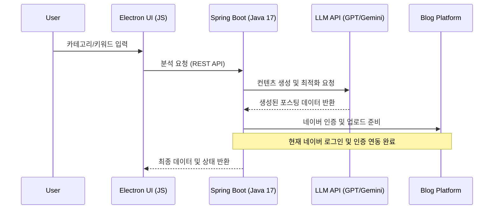

# 🤖 AI-Log: Content Automation System
> **엔터프라이즈 시스템 설계 역량을 기반으로 한 AI 블로그 자동화 솔루션**

---

## 📌 Project Strategy
본 프로젝트는 **PLM/ALM 환경에서 축적한 시스템 통합(SI) 및 워크플로우 설계 경험**을 퍼스널 도구로 확장한 사례입니다. 
단순한 스크립트를 넘어, 확장 가능한 **Backend-to-Desktop 아키텍처**를 지향합니다.

### 🧩 Key Implementation
- **AI Orchestration:** 다중 LLM(OpenAI, Google Gemini) API를 활용한 컨텐츠 품질 최적화.
- **Robust Integration:** Java Spring Boot 기반의 안정적인 API 통신 모듈 및 인증(OAuth 2.0) 처리.
- **Hybrid Desktop Arch:** Electron과 Java 로컬 서버 간의 고성능 REST/IPC 통신 구조 확립.
- **Containerized Environment:** Docker 기반 빌드 표준화로 서비스 실행 및 배포 환경의 일관성 확보.
---

## 🏗️ System Data Flow

## 📺 시연 영상 (Demo)

